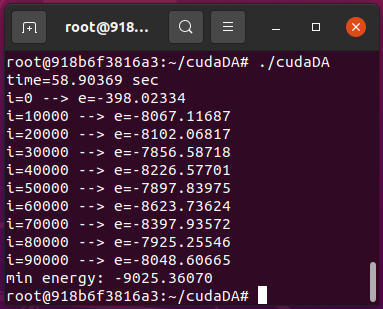

# CudaDigitalAnnealing

[Code Source](https://github.com/Shutoparu/CudaDigitalAnnealing.git)

## C code

This is the c prototype of the algorithm.

## Cuda C code

Used OS: Ubuntu 20.04.3 LTS

kernel: Linux 5.13.0-51-generic

Used image version: nvidia/cuda:10.0-devel-ubuntu18.04

command to create container: docker run -it --gpus all nvidia/cuda:10.0-devel-ubuntu18.04 bash

To compile and run the Cuda C code, run in terminal:

> nvcc cudaDigitalAnnealing.cu -o cudaDA
> 
> ./cudaDA

### result: 
the algorithm spent 59 seconds to finish 100,000 iterations,
compared to python Simulated Annealing algorithm which spent 200 seconds

## python code

This is the code that allow users to put in their own data.

Used Python version: 3.6.0